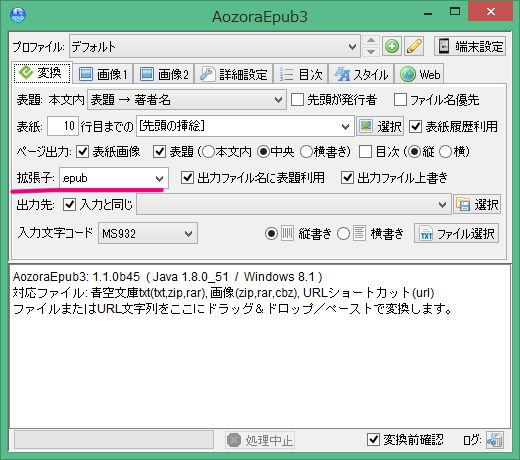
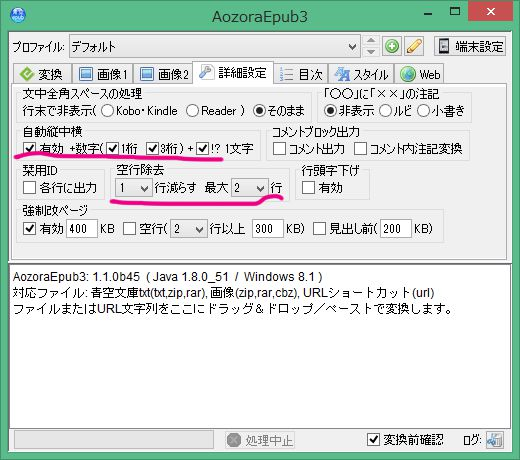
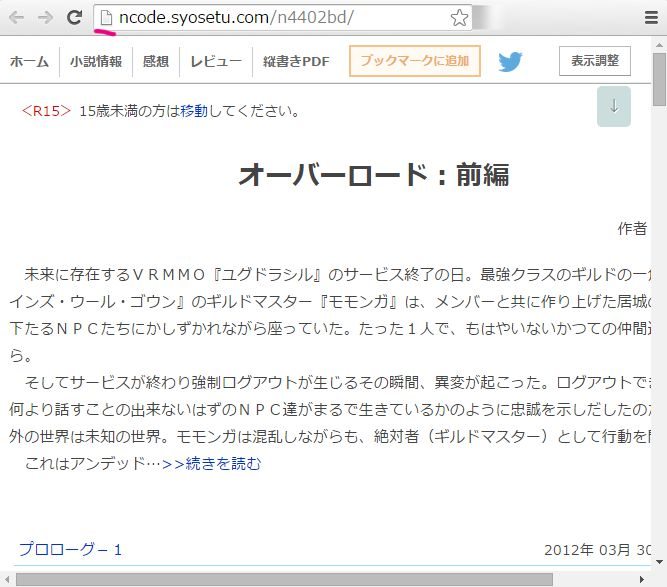
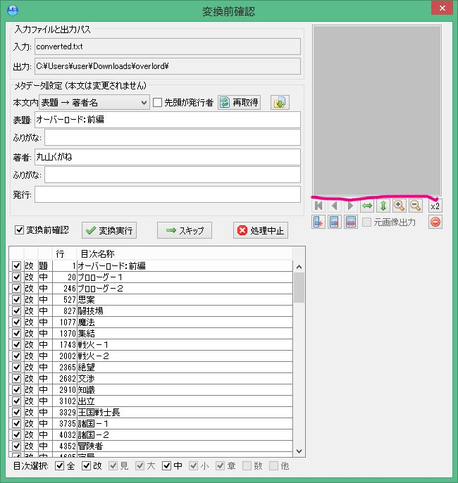
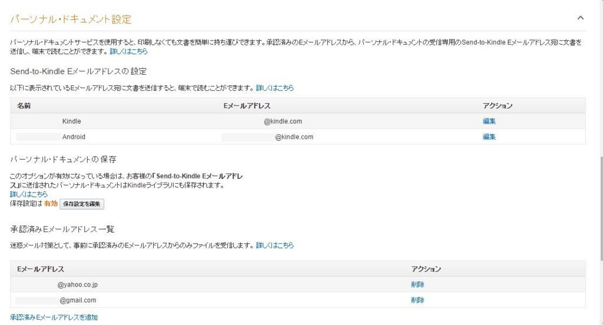

import Amazon from "../../../src/components/amazon"
import Hatena from "../../../src/components/hatena"

### AozoraEpub3

　小説家になろうで連載されている小説はAozoraEpub3を使えばキンドルで読むことができるようになります。「小説家になろう/小説を読もう！」(＋関連サイト)以外にも、「NEWVEL-LIBRARY」「FC2小説」「HAMELN」「Arcadia」「novelist.jp」「dNoVeLs」「暁」「カクヨム」「ノベルアップ＋」から取得が可能です。キンドルで売られていないけれど電子書籍化して読むことは可能となってる。EPUBという形式はキンドルだけではなく、koboやソニーリーダー、iPhone、アンドロイド端末でも読むことが可能になっています。アンドロイド端末ではkinoppyがおすすめ。AozoraEpub3はPCがないと変換できない。

小説家になろうをキンドルで読む
<Hatena src="https://www.youtube.com/watch?v=qxcDw5nWd10" title="小説家になろうをキンドルで読む"/>

青空文庫のEPUB変換とAozoraEpub3のセットアップ

<Hatena src="https://www.youtube.com/watch?v=SHeUvLXaycc" title="青空文庫のEPUB変換とAozoraEpub3のセットアップ"/>

　AozoraEpub3の本家のほうは最近更新されてないので、クローンを作って挿絵が読み込まれない不具合を修正しました。下のサイトからAozoraEpub3をダウンロードしてください。

Assetsの下の「AozoraEpub3-1.1.1b17Q.zip」をクリックすることでダウンロードできます。バージョンは最新のものがおすすめ。

<Hatena src="https://github.com/kyukyunyorituryo/AozoraEpub3/releases" title="AozoraEpub3のダウンロード"/>

Javaが入っていない人はjavaをインストールする必要がある。

<Hatena src="https://adoptium.net/temurin/releases/?version=17" title="Latest Releases | Adoptium"/>

Windowsの場合はOperating System：Windows、Architecture：x64、Package Type：JRE、Version：11を選んでインストールしてください。

### AozoraEpub3の起動画面

拡張子と書いているところにepubとでいている。send to kindleを使う場合はepubのままでいい。端末と直接USBでつないでkindleで読む場合はmobiにしてください。mobiに変換するのにはkindlegenがいるので下の方のリンクからOSに合ったのをダウンロードして入れる必要がある。

　AozoraEpub3を解凍して、その時にCドライブのprogram filesに入れると実行できない場合があるので、デスクトップなどに解凍するといいでしょう。

### kindlegen

kindlegenはepubをkindleで読める形式に変換するツールです。単体でのkindlegenの配布がなくなりました。Kindle Previewer 3内のkindlegenを取り出してください。

### Kindle Previewer 

　Kindle Previewer をインストールする

<Hatena src="https://kdp.amazon.co.jp/ja_JP/help/topic/G202131170" title="Kindle Previewer"/>

OSにあったKindle Previewerをインストールしてください。kindlegenの単体での配布が終了しました。Windowsの場合はKindle Previewer 3をインストールし、Kindle Previewer 3フォルダー内に「C:\Users\user\AppData\Local\Amazon\Kindle Previewer 3\lib\fc\bin」kindlegenがあります。userはご自分のユーザー名に置き換えてください。

　koboやsony readerやkinoppyなどではepubを選べばいい。キンドルではepubを直接は読むことができないのでmobiという形式に変換する。kindlegenやkindlePreviewerというのを使うのだけれど、AozoraEpub３のフォルダーにkindlegenを入れるだけでmobiに変換してくれる用になります。

### sendtokindle

send to kindleは「 PDF、DOC、DOCX、TXT、RTF、HTM、HTML、PNG、GIF、JPG、JPEG、BMP、EPUB」などのファイルをkindleで読める形式に変換してからkindleに送るサービスです。このサービスを使う場合はEPUBが適しています。

<Hatena src="https://www.amazon.co.jp/sendtokindle" title="sendtokindle"/>

「小説家になろう」では初期設定のままでは、表示が変な場合があるので、線を引いたところを変えるといいと思います。

次になろうのサイトからAozoraEpub3に一括ダウンロードするそのやり方はchromeでは、下線の部分を[ファイルまたはURL文字列をここにドラッグ＆ドロップ／ペーストで変換します]の部分にドラッグアンドドロップすることで、一括してダウンロードされます。保存場所は任意に指定できる。

[オーバーロード：前編](https://ncode.syosetu.com/n4402bd/)

　保存場所を指定すると、変換前確認画面が出るので、表紙を指定したい場合は、赤線が引いていある部分にjpg画像などをドラッグアンドドロップする。

 そうして出力されたmobiファイルをkindleのdocumentフォルダーに入れるキンドルで読むことが可能になる。

### パーソナルドキュメントサービス

パーソナルドキュメントというのを利用する方法があるのでそっちの説明もおこうなる。

「my kindle」とグーグルなどで検索して出てきたサイトからアマゾンにログインする。

そのページから設定をクリックして。下の方を見ていくと、次のような画面が出てくる。キンドルペーパーホワイトやアンドロイドに割り当てられたメールアドレスが出てきます。そのメールアドレス宛に、さっき作ったmobiファイルを添付して送り、その端末がネットにつないで本をダウンロードできる状態にすると作った本が送られてきます。ただ送るときのメールアドレスも、承認済みEメールアドレスに追加していないと受信できないようになっています。gmailだったりヤフーというようなフリーメールも使えるようになっています。

<Amazon asin="B0B9WV9GVS" />